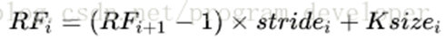

## Welcome to RogerJTX's Programming Notes

[editor on GitHub](https://github.com/RogerJTX/RogerJTX.github.io/edit/main/index.md) 

# My Main Notes Websites

Main Notes Website  
[https://rogerjtx.github.io/](https://rogerjtx.github.io/)

Neural Network [CNN, RNN]  
[https://rogerjtx.github.io/](https://rogerjtx.github.io/)
 
Word2Vector [ELMo, Bert, ALBert]    
[https://rogerjtx.github.io/word2vector.io/](https://rogerjtx.github.io/word2vector.io/) 

Topbase Knowledge Graph Paper Reproduction And Technical Documentation  
[https://rogerjtx.github.io/topbase_knowledge_graph/](https://rogerjtx.github.io/topbase_knowledge_graph/)

Automatic Code Generation [based on GPT-2]   
[https://rogerjtx.github.io/auto_code_generation/](https://rogerjtx.github.io/auto_code_generation/)

Comelot Table Image Recognition   
url:

Aminer Knowledge Graph Comprehensive Technical Document  
url:

Patent System Keyword Extractor    
[https://rogerjtx.github.io/patent_knowledge_graph/](https://rogerjtx.github.io/patent_knowledge_graph/)

Expert Knowledge Graph KbpPipeline  
[https://rogerjtx.github.io/kbp_pipeline/](https://rogerjtx.github.io/kbp_pipeline/) 

Arbitrary Style Transfer via Multi-Adaptation Network 
url:

Image Segmentation Based on Overlapping Cells  
url:

Medical Image Recognition [COVID-19]    
url:

# Content:

# Programming Notes Start

----------------------------------------

# CNN 中的基本概念

### 1.神经网络 https://zhuanlan.zhihu.com/p/654721

#### 1.1 两层神经网络

这里我们构建一个两层神经网络，理论上两层神经网络已经可以拟合任意函数。这个神经网络的结构如下图：
 

简化后：

 
从输入层到隐藏层：连接输入层和隐藏层的是W1和b1。由X计算得到H十分简单，就是矩阵运算
 

 
从隐藏层到输出层：连接隐藏层和输出层的是W2和b2。同样是通过矩阵运算进行的：

 
#### 1.2 激活层 

激活层是为矩阵运算的结果添加非线性的。常用的激活函数有三种，分别是阶跃函数、Sigmoid和ReLU。不要被奇怪的函数名吓到，其实它们的形式都很简单，如下图（更正：sigmoid在负无穷是应趋近于0）：
 
  
图3.三种常用的激活函数

激活函数具体是怎么计算的呢？

假如经过公式H=X*W1+b1计算得到的H值为：(1,-2,3,-4,7...)，那么经过阶跃函数激活层后就会变为(1,0,1,0,1...)，经过ReLU激活层之后会变为(1,0,3,0,7...)。

需要注意的是，每个隐藏层计算（矩阵线性运算）之后，都需要加一层激活层，要不然该层线性计算是没有意义的。

此时的神经网络变成了如下图所示的形式：
 
   
图4.加上激活层的两层神经网络

我们都知道神经网络是分为“训练”和“使用”两个步骤的。如果是在“使用”的步骤，图4就已经完成整个过程了，在求得的Y（大小为1*4）矩阵中，数值最大的就代表着当前分类。

但是对于用于“训练”的网络，图4还远远不够。

#### 1.3 输出的正规化
1.3.1	在图4中，输出Y的值可能会是(3,1,0.1,0.5)这样的矩阵，诚然我们可以找到里边的最大值“3”，从而找到对应的分类为I，但是这并不直观。我们想让最终的输出为概率，也就是说可以生成像(90%,5%,2%,3%)这样的结果，这样做不仅可以找到最大概率的分类，而且可以知道各个分类计算的概率值。具体是怎么计算的呢？
计算公式如下：
 

 
简单来说分三步进行：（1）以e为底对所有元素求指数幂；（2）将所有指数幂求和；（3）分别将这些指数幂与该和做商。

这样求出的结果中，所有元素的和一定为1，而每个元素可以代表概率值。

我们将使用这个计算公式做输出结果正规化处理的层叫做“Softmax”层。此时的神经网络将变成如下图所示：

#### 1.4 如何衡量输出的好坏

通过Softmax层之后，我们得到了I，II，III和IV这四个类别分别对应的概率，但是要注意，这是神经网络计算得到的概率值结果，而非真实的情况。

比如，Softmax输出的结果是(90%,5%,3%,2%)，真实的结果是(100%,0,0,0)。虽然输出的结果可以正确分类，但是与真实结果之间是有差距的，一个优秀的网络对结果的预测要无限接近于100%，为此，我们需要将Softmax输出结果的好坏程度做一个“量化”。

一种直观的解决方法，是用1减去Softmax输出的概率，比如1-90%=0.1。不过更为常用且巧妙的方法是，求对数的负数。

还是用90%举例，对数的负数就是：-log0.9=0.046

可以想见，概率越接近100%，该计算结果值越接近于0，说明结果越准确，该输出叫做“交叉熵损失（Cross Entropy Error）”。

我们训练神经网络的目的，就是尽可能地减少这个“交叉熵损失”。

此时的网络如下图：

\
图6.计算交叉熵损失后的神经网络

#### 1.5	反向传播与参数优化
上边的1~4节，讲述了神经网络的正向传播过程。一句话复习一下：神经网络的传播都是形如Y=WX+b的矩阵运算；为了给矩阵运算加入非线性，需要在隐藏层中加入激活层；输出层结果需要经过Softmax层处理为概率值，并通过交叉熵损失来量化当前网络的优劣。

算出交叉熵损失后，就要开始反向传播了。其实反向传播就是一个参数优化的过程，优化对象就是网络中的所有W和b（因为其他所有参数都是确定的）。

神经网络的神奇之处，就在于它可以自动做W和b的优化，在深度学习中，参数的数量有时会上亿，不过其优化的原理和我们这个两层神经网络是一样的。

这里举一个形象的例子描述一下这个参数优化的原理和过程：

假设我们操纵着一个球型机器行走在沙漠中

我们在机器中操纵着四个旋钮，分别叫做W1，b1，W2，b2。当我们旋转其中的某个旋钮时，球形机器会发生移动，但是旋转旋钮大小和机器运动方向之间的对应关系是不知道的。而我们的目的就是走到沙漠的最低点。

此时我们该怎么办？只能挨个试喽。

如果增大W1后，球向上走了，那就减小W1。

如果增大b1后，球向下走了，那就继续增大b1。

如果增大W2后，球向下走了一大截，那就多增大些W2。

。。。

这就是进行参数优化的形象解释（有没有想到求导？），这个方法叫做梯度下降法。

当我们的球形机器走到最低点时，也就代表着我们的交叉熵损失达到最小（接近于0）。

关于反向传播，还有许多可以讲的，但是因为内容较多，就放在下一篇文章中说吧。不过上述例子对于理解神经网络参数优化的过程，还是很有帮助的。

#### 1.6	迭代

神经网络需要反复迭代。

如上述例子中，第一次计算得到的概率是90%，交叉熵损失值是0.046；将该损失值反向传播，使W1,b1,W2,b2做相应微调；再做第二次运算，此时的概率可能就会提高到92%，相应地，损失值也会下降，然后再反向传播损失值，微调参数W1,b1,W2,b2。依次类推，损失值越来越小，直到我们满意为止。

此时我们就得到了理想的W1,b1,W2,b2。

此时如果将任意一组坐标作为输入，利用图4或图5的流程，就能得到分类结果。

### 2.拟合 fitting

“最小二乘法”：即“最佳拟合直线”是使样本点到该直线的离差平方和达到最小的直线（采用垂直距离）。
拟合值就是通过最小二乘法拟合后在某点的预测值。

形象的说，拟合就是把平面上一系列的点，用一条光滑的曲线连接起来。因为这条曲线有无数种可能，从而有各种拟合方法。拟合的曲线一般可以用函数表示，根据这个函数的不同有不同的拟合名字。
常用的拟合方法有如最小二乘曲线拟合法等，在MATLAB中也可以用polyfit 来拟合多项式。拟合以及插值还有逼近是数值分析的三大基础工具，通俗意义上它们的区别在于：拟合是已知点列，从整体上靠近它们；插值是已知点列并且完全经过点列；逼近是已知曲线，或者点列，通过逼近使得构造的函数无限靠近它们。

无论在机器学习还是深度学习建模当中都可能会遇到两种最常见结果，一种叫过拟合（over-fitting ）另外一种叫欠拟合（under-fitting）。

首先谈谈什么是过拟合呢？什么又是欠拟合呢？网上很直接的图片理解如下：

 
### 3.池化（pooling） https://www.zhihu.com/question/303215483/answer/615115629

#### 3.1 CNN中pooling层的作用 https://www.cnblogs.com/makefile/p/pooling.html https://blog.csdn.net/kele_imon/article/details/79532286

> 池化的作用 pooling，小名池化，思想来自于视觉机制，是对信息进行抽象的过程。简而言之，池化就是去除杂余信息，保留关键信息。 

上图就是一个池化的示意图，用了一个10*10的卷积核，对20*20的图像分块不重叠的进行了池化，池化之后featuremap为2*2的大小。

1、增大感受野所谓感受野，即一个像素对应回原图的区域大小，假如没有pooling，一个3*3，步长为1的卷积，那么输出的一个像素的感受野就是3*3的区域，再加一个stride=1的3*3卷积，则感受野为5*5。假如我们在每一个卷积中间加上3*3的pooling呢？很明显感受野迅速增大，这就是pooling的一大用处。感受野的增加对于模型的能力的提升是必要的，正所谓“一叶障目则不见泰山也”。

2、平移不变性我们希望目标的些许位置的移动，能得到相同的结果。因为pooling不断地抽象了区域的特征而不关心位置，所以pooling一定程度上增加了平移不变性。

3、降低优化难度和参数我们可以用步长大于1的卷积来替代池化，但是池化每个特征通道单独做降采样，与基于卷积的降采样相比，不需要参数，更容易优化。全局池化更是可以大大降低模型的参数量和优化工作量。

#### 3.2 池化有哪些

#### 3.2.1 平均池化和最大池化

这是我们最熟悉的，通常认为如果选取区域均值(mean pooling)，往往能保留整体数据的特征，较好的突出背景信息；如果选取区域最大值(max pooling)，则能更好保留纹理特征。

#### 3.2.2 stochastic pooling/mixed poolingstochastic pooling对feature map中的元素按照其概率值大小随机选择，元素被选中的概率与其数值大小正相关，这就是一种正则化的操作了。mixed pooling就是在max/average pooling中进行随机选择。

#### 3.3.3 Data Driven/Detail-Preserving Pooling上面的这些方法都是手动设计，而现在深度学习各个领域其实都是往自动化的方向发展。我们前面也说过，从激活函数到归一化都开始研究数据驱动的方案，池化也是如此，每一张图片都可以学习到最适合自己的池化方式。此外还有一些变种如weighted max pooling，Lp pooling，generalization max pooling就不再提了，还有global pooling。

### 4.感受野（Receptive Field） https://blog.csdn.net/program_developer/article/details/80958716

#### 4.1	概念
在卷积神经网络中，感受野（Receptive Field）的定义是卷积神经网络每一层输出的特征图（feature map）上的像素点在输入图片上映射的区域大小。再通俗点的解释是，特征图上的一个点对应输入图上的区域，如图1所示。

#### 4.2	实例

两层3*3的卷积核卷积操作之后的感受野是5*5，其中卷积核（filter）的步长（stride）为1、padding为0，如图2所示：

\
图2：两层3*3卷积核操作之后的感受野是5*5

三层3*3卷积核操作之后的感受野是7*7，其中卷积核的步长为1，padding为0，如图3所示：

\
图3：三层3*3卷积核操作之后的感受野是7*7

#### 4.3	感受野的计算

感受野计算时有下面几个知识点需要知道：

    . 最后一层（卷积层或池化层）输出特征图感受野的大小等于卷积核的大小。
    . 第i层卷积层的感受野大小和第i层的卷积核大小和步长有关系，同时也与第（i+1）层感受野大小有关。
    . 计算感受野的大小时忽略了图像边缘的影响，即不考虑padding的大小。

关于感受野大小的计算方式是采用从最后一层往下计算的方法，即先计算最深层在前一层上的感受野，然后逐层传递到第一层，使用的公式可以表示如下：
 

其中，RFi是第i层卷积层的感受野，是RF(i+1)层上的感受野，stride是卷积的步长，Ksize是本层卷积核的大小。

### 5.卷积核convolution kernel 

卷积核就是图像处理时，给定输入图像，输入图像中一个小区域中像素加权平均后成为输出图像中的每个对应像素，其中权值由一个函数定义，这个函数称为卷积核。

### 6.CNN基础知识——卷积（Convolution）、填充（Padding）、步长(Stride)   

https://zhuanlan.zhihu.com/p/771866

### 6.1	CNN介绍

卷积神经网络（convolutional neural network，CNN）是指至少在网络的一层中使用卷积运算来代替一般的矩阵乘法运算的神经网络，因此命名为卷积神经网络。那什么是卷积运算啊？接下来我们一起来揭开它神秘的面纱。

### 6.2	卷积（Convolution）

我们以灰度图像为例进行讲解：从一个小小的权重矩阵，也就是卷积核（kernel）开始，让它逐步在二维输入数据上“扫描”。卷积核“滑动”的同时，计算权重矩阵和扫描所得的数据矩阵的乘积，然后把结果汇总成一个输出像素。

### 6.3	填充（Padding）

前面可以发现，输入图像与卷积核进行卷积后的结果中损失了部分值，输入图像的边缘被“修剪”掉了（边缘处只检测了部分像素点，丢失了图片边界处的众多信息）。这是因为边缘上的像素永远不会位于卷积核中心，而卷积核也没法扩展到边缘区域以外。

### 6.4	步长(Stride)

滑动卷积核时，我们会先从输入的左上角开始，每次往左滑动一列或者往下滑动一行逐一计算输出，我们将每次滑动的行数和列数称为Stride，在之前的图片中，Stride=1；在下图中，Stride=2。

### 6.5 过程

卷积过程中，有时需要通过padding来避免信息损失，有时也要在卷积时通过设置的步长（Stride）来压缩一部分信息，或者使输出的尺寸小于输入的尺寸。

### 6.6	卷积核的大小一般为奇数*奇数

>1*1，3*3，5*5，7*7都是最常见的。这是为什么呢？为什么没有偶数*偶数？

（1）更容易padding

在卷积时，我们有时候需要卷积前后的尺寸不变。这时候我们就需要用到padding。假设图像的大小，也就是被卷积对象的大小为n*n，卷积核大小为k*k，padding的幅度设为(k-1)/2时，卷积后的输出就为(n-k+2*((k-1)/2))/1+1=n，即卷积输出为n*n，保证了卷积前后尺寸不变。但是如果k是偶数的话，(k-1)/2就不是整数了。

（2）更容易找到卷积锚点

在CNN中，进行卷积操作时一般会以卷积核模块的一个位置为基准进行滑动，这个基准通常就是卷积核模块的中心。若卷积核为奇数，卷积锚点很好找，自然就是卷积模块中心，但如果卷积核是偶数，这时候就没有办法确定了，让谁是锚点似乎都不怎么好。

>【卷积的计算公式】

输入图片的尺寸：一般用n x n 表示输入的image大小。

卷积核的大小：一般用 f x f 表示卷积核的大小。

填充（Padding）：一般用 p 来表示填充大小。

步长(Stride)：一般用 s 来表示步长大小。

输出图片的尺寸：一般用 o 来表示。

如果已知 n 、 f 、 p 、 s 可以求得 o ，计算公式如下：

其中""是向下取整符号，用于结果不是整数时进行向下取整。

### 6.7	多通道卷积

上述例子都只包含一个输入通道。实际上，大多数输入图像都有 RGB 3个通道。

 
这里就要涉及到“卷积核”和“filter”这两个术语的区别。在只有一个通道的情况下，“卷积核”就相当于“filter”，这两个概念是可以互换的。但在一般情况下，它们是两个完全不同的概念。每个“filter”实际上恰好是“卷积核”的一个集合，在当前层，每个通道都对应一个卷积核，且这个卷积核是独一无二的。

多通道卷积的计算过程：将矩阵与滤波器对应的每一个通道进行卷积运算，最后相加，形成一个单通道输出，加上偏置项后，我们得到了一个最终的单通道输出。如果存在多个filter，这时我们可以把这些最终的单通道输出组合成一个总输出。

这里我们还需要注意一些问题——滤波器的通道数、输出特征图的通道数。

某一层滤波器的通道数 = 上一层特征图的通道数。如上图所示，我们输入一张6x6x3的RGB图片，那么滤波器（ 3x3x3 ）也要有三个通道。

某一层输出特征图的通道数 = 当前层滤波器的个数。如上图所示，当只有一个filter时，输出特征图（4x4）的通道数为1；当有2个filter时，输出特征图（4x4x2 ）的通道数为2。

# 数学中的卷积和图像中的卷积神经网络中

数学中的卷积和图像中的卷积神经网络中的卷积严格意义上是两种不同的运算

### 1.【图像】二维离散卷积的定义

【图像】二维离散卷积的定义是：

 
这里， f指输入的数据矩阵， g是权重系数矩阵，即通常所说的卷积核。

举个栗子，看看具体是怎么算的

f是一个m*n的像素矩阵

\
上图为f矩阵图

g是一个定义好的3*3的卷积核

现在计算 

也就是如下两个矩阵做卷积

 
注意为了实现卷积运算，卷积核的下标与矩阵f是不相同的
 

 
在上图中可以清晰地看到数学中卷积运算的特点：

卷积核与原始的矩阵乘积，是围绕着中心元素进行180度旋转后，才是对应的元素

### 2.为什么说是互相关函数呢？把上述的运算写成公式

 
可以概括为：第一个函数依次作复共轭（这里是实数，不用取共轭）和平移后与第二个函数相乘的无穷积分（离散情形为求和）
这正是互相关计算的定义:

两个函数互相关的含义是：对两个函数分别作复数共轭和反向平移并使其相乘的无穷积分，或者说：第一个函数依次作复共轭和平移后与第二个函数相乘的无穷积分。可以证明，两个定义完全等价(可以互相导出)。从物理上看，互相关运算的结果反映了两个信号之间相似性的量度。特别是对于实函数f(x)和h(x)而言，其相关运算相当于求两函数的曲线相对平移 1个参变量x后形成的重叠部分与横轴所围区域的面积

所以说CNN是在提取图像的每个局部（感受野）范围和卷积核的互相关函数

### 3.spatial filter 平滑滤波 边缘提取

这两种件事情，很容易通过设计特定的“卷积核”，然后将其与像素矩阵的对应元素（不进行上述的旋转）相乘得到
   

实现的原理也很简单：

a）就是将中心像素值与周围临近的像素进行平均，自然就能“削峰填谷”，实现平滑处理
b）就是将中心像素值复制n份，然后减去周围的n个临近像素值。所以如果是在区域位置（四周像素值都很相近），像素值肯定就“减”为0；只有在边缘位置（与周围的像素值差别比较大），相减后才能留下。
